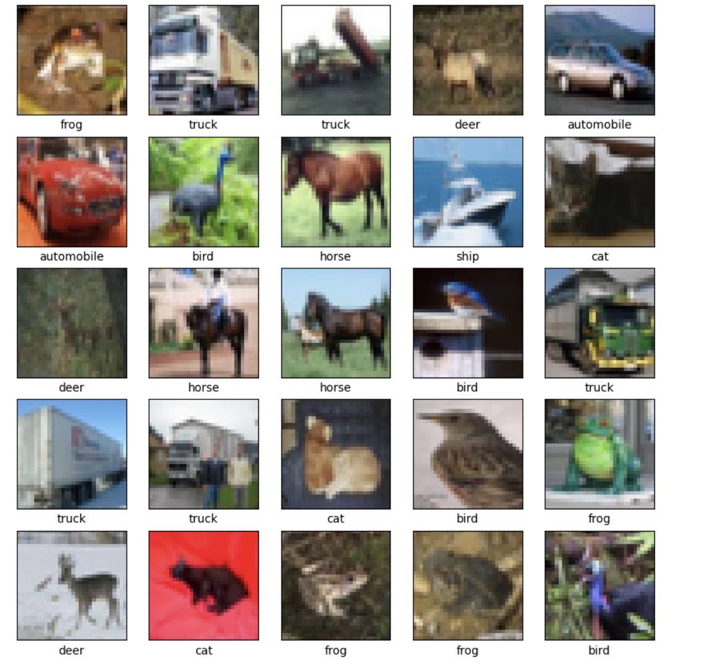
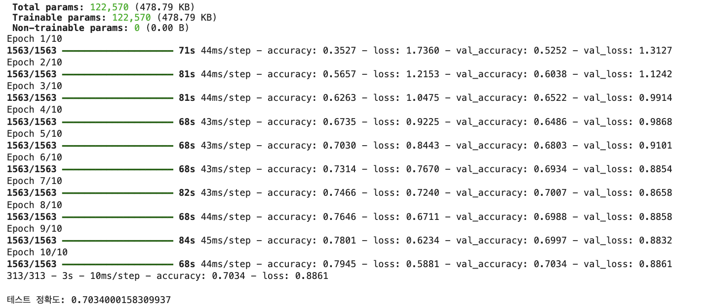
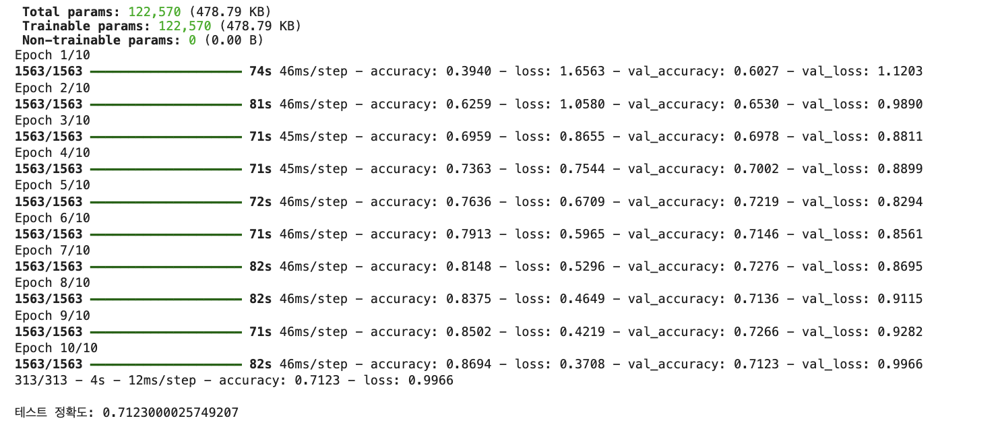

# 딥러닝의 활성화 함수

이 레포지토리는 다양한 활성화 함수가 실제 딥러닝 모델에서 어떻게 사용되는지 보여주는 Python 코드 예제를 포함하고 있습니다. 이 코드는 활성화 함수를 소개하는 발표 자료에서 사용되었습니다.

## 활성화 함수별 코드 예제

### Sigmoid
- **이진 분류**: Sigmoid 활성화 함수를 이진 분류 문제에서 사용한 예제입니다. Sigmoid는 0과 1 사이의 확률을 예측할 때 주로 사용됩니다.  
  파일: [`sigmoid_in_binary.py`](sigmoid_in_binary.py)
  
- **RNN에서 사용**: 순환 신경망(RNN) 내에서 Sigmoid 활성화 함수를 사용하는 예제입니다. 순환 구조에서 시퀀스 데이터를 처리할 때 유용하게 사용됩니다.  
  파일: [`sigmoid_in_rnn.py`](sigmoid_in_rnn.py)

### Tanh
- **LSTM에서 사용**: LSTM(Long Short-Term Memory) 네트워크에서 `tanh` 활성화 함수를 사용하는 예제입니다. `tanh`는 -1과 1 사이의 값을 출력하며, LSTM의 게이트에서 중요한 역할을 합니다.  
  파일: [`tanh_in_lstm.py`](tanh_in_lstm.py)

### LSTM (with Tanh)
LSTM 네트워크에서 `tanh` 활성화 함수를 사용하는 NLP(자연어 처리) 예제입니다. LSTM은 긴 시퀀스에서도 정보를 유지하는 데 효과적입니다.  
파일: [`lstm_in_nlp.py`](lstm_in_nlp.py)

### ReLU

#### CIFAR-10
Relu와 Leaky Relu모두 CIFAR-10 이미지 인식 방법을 사용하였습니다 

ReLU(정류된 선형 유닛) 활성화 함수를 사용한 CNN 예제입니다. ReLU는 이미지 처리 작업에서 간단하면서도 효과적인 활성화 함수로 많이 사용됩니다.  

Relu의 정확도는 70%정도로 나왔습니다. 
  
파일: [`relu_in_cnn.py`](relu_in_cnn.py)

### Leaky ReLU
Leaky ReLU 활성화 함수를 사용한 합성곱 신경망(CNN) 예제입니다. Leaky ReLU는 입력이 음수일 때도 작은 기울기를 유지해 "죽은 ReLU" 문제를 해결합니다.  

LeakyRelu의 정확도는 71%정도로 Relu보다 조금 더 높은 정확도를 확인 할 수 있습니다. 
에서 확인 가능합니다.  

파일: [`leakyReLu_in_cnn.py`](leakyRelu_in_cnn.py)

## 설명

이 레포지토리의 코드는 딥러닝 모델에서 사용되는 활성화 함수들의 동작을 설명하고, 각각의 함수가 어떻게 특정 문제에 맞게 활용되는지를 보여줍니다.
